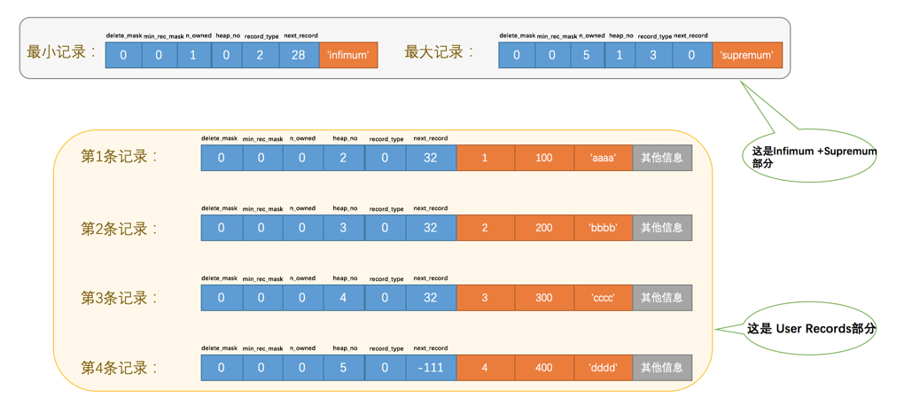

它是`InnoDB`管理存储空间的基本单位，一个页的大小一般是`16KB`。`InnoDB`为了不同的目的而设计了许多种不同类型的`页`，比如存放表空间头部信息的页，存放`Insert Buffer`信息的页，存放`INODE`信息的页，存放`undo`日志信息的页等等。存放我们表中记录的那种类型的页称这种存放记录的页为索引（`INDEX`）页或数据页。

数据页代表的这块`16KB`大小的存储空间可以被划分为多个部分，不同部分有不同的功能，各个部分如图所示：

| 名称                 | 中文名             | 占用空间大小 | 简单描述                 |
| -------------------- | ------------------ | ------------ | ------------------------ |
| `File Header`        | 文件头部           | `38`字节     | 页的一些通用信息         |
| `Page Header`        | 页面头部           | `56`字节     | 数据页专有的一些信息     |
| `Infimum + Supremum` | 最小记录和最大记录 | `26`字节     | 两个虚拟的行记录         |
| `User Records`       | 用户记录           | 不确定       | 实际存储的行记录内容     |
| `Free Space`         | 空闲空间           | 不确定       | 页中尚未使用的空间       |
| `Page Directory`     | 页面目录           | 不确定       | 页中的某些记录的相对位置 |
| `File Trailer`       | 文件尾部           | `8`字节      | 校验页是否完整           |

我们自己存储的记录会按照我们指定的`行格式`存储到`User Records`部分。但是在一开始生成页的时候，其实并没有`User Records`这个部分，每当我们插入一条记录，都会从`Free Space`部分，也就是尚未使用的存储空间中申请一个记录大小的空间划分到`User Records`部分，当`Free Space`部分的空间全部被`User Records`部分替代掉之后，也就意味着这个页使用完了，如果还有新的记录插入的话，就需要去申请新的页了。

#### 记录在页中的存储

记录头信息中：

- `delete_mask`

  这个属性标记着当前记录是否被删除，占用1个二进制位，值为`0`的时候代表记录并没有被删除，为`1`的时候代表记录被删除掉了。

  这些被删除的记录之所以不立即从磁盘上移除，是因为移除它们之后把其他的记录在磁盘上重新排列需要性能消耗，所以只是打一个删除标记而已，所有被删除掉的记录都会组成一个所谓的`垃圾链表`，在这个链表中的记录占用的空间称之为所谓的`可重用空间`，之后如果有新记录插入到表中的话，可能把这些被删除的记录占用的存储空间覆盖掉。

- min_rec_mask

  B+树的每层非叶子节点中的最小记录都会添加该标记

- heap_no

  这个属性表示当前记录在本`页`中的位置，从2开始，他们自动给每个页里边儿加了两个记录，由于这两个记录并不是我们自己插入的，所以有时候也称为`伪记录`或者`虚拟记录`。这两个伪记录一个代表`最小记录`，一个代表`最大记录`。

  不管我们向`页`中插入了多少自己的记录，`InnoDB`都规定他们定义的两条伪记录分别为最小记录与最大记录，他们被单独放在一个称为`Infimum + Supremum`的部分。，最小记录和最大记录的`heap_no`值分别是`0`和`1`。

  

- record_type

  这个属性表示当前记录的类型，一共有4种类型的记录，`0`表示普通记录，`1`表示B+树非叶节点记录，`2`表示最小记录，`3`表示最大记录。从图中我们也可以看出来，我们自己插入的记录就是普通记录，它们的`record_type`值都是`0`，而最小记录和最大记录的`record_type`值分别为`2`和`3`。
  
- next_record

  它表示从当前记录的真实数据到下一条记录的真实数据的地址偏移量。比方说第一条记录的`next_record`值为`32`，意味着从第一条记录的真实数据的地址处向后找`32`个字节便是下一条记录的真实数据。这其实是个`链表`，可以通过一条记录找到它的下一条记录。`下一条记录`指得并不是按照我们插入顺序的下一条记录，而是按照主键值由小到大的顺序的下一条记录。而且规定 ***Infimum记录（也就是最小记录）*** 的下一条记录就是本页中主键值最小的用户记录，而本页中主键值最大的用户记录的下一条记录就是 ***Supremum记录（也就是最大记录）*** 。

  `最大记录`的`next_record`的值为`0`，这也就是说最大记录是没有`下一条记录`了，它是这个单链表中的最后一个节点。

#### Page Directory

现在我们了解了记录在页中按照主键值由小到大顺序串联成一个单链表，那如果我们想根据主键值查找页中的某条记录该咋办呢？Page Directory就是用来查找页内的数据。

1. 将所有正常的记录（包括最大和最小记录，不包括标记为已删除的记录）划分为几个组。
2. 每个组的最后一条记录（也就是组内最大的那条记录）的头信息中的`n_owned`属性表示该记录拥有多少条记录，也就是该组内共有几条记录。
3. 将每个组的最后一条记录的地址偏移量单独提取出来按顺序存储到靠近`页`的尾部的地方，这个地方就是所谓的`Page Directory`，也就是`页目录`（此时应该返回头看看页面各个部分的图）。页面目录中的这些地址偏移量被称为`槽`（英文名：`Slot`），所以这个页面目录就是由`槽`组成的。

现在`页目录`部分中有两个槽，也就意味着我们的记录被分成了两个组，`槽1`中的值是`112`，代表最大记录的地址偏移量（就是从页面的0字节开始数，数112个字节）；`槽0`中的值是`99`，代表最小记录的地址偏移量。

- 最小记录的`n_owned`值为`1`，这就代表着以最小记录结尾的这个分组中只有`1`条记录，也就是最小记录本身。
- 最大记录的`n_owned`值为`5`，这就代表着以最大记录结尾的这个分组中只有`5`条记录，包括最大记录本身还有我们自己插入的`4`条记录。

InnoDB规定对于最小记录所在的分组只能有 ***1*** 条记录，最大记录所在的分组拥有的记录条数只能在 ***1~8*** 条之间，剩下的分组中记录的条数范围只能在是 ***4~8*** 条之间。所以分组是按照下边的步骤进行的：

- 初始情况下一个数据页里只有最小记录和最大记录两条记录，它们分属于两个分组。
- 之后每插入一条记录，都会从`页目录`中找到主键值比本记录的主键值大并且差值最小的槽，然后把该槽对应的记录的`n_owned`值加1，表示本组内又添加了一条记录，直到该组中的记录数等于8个。
- 在一个组中的记录数等于8个后再插入一条记录时，会将组中的记录拆分成两个组，一个组中4条记录，另一个5条记录。这个过程会在`页目录`中新增一个`槽`来记录这个新增分组中最大的那条记录的偏移量。

#### Page Header

为了能得到一个数据页中存储的记录的状态信息，比如本页中已经存储了多少条记录，第一条记录的地址是什么，页目录中存储了多少个槽等等，特意在页中定义了一个叫`Page Header`的部分，它是`页`结构的第二部分，这个部分占用固定的`56`个字节，专门存储各种状态信息，具体各个字节都是干嘛的看下表：

| 名称                | 占用空间大小 | 描述                                                         |
| ------------------- | ------------ | ------------------------------------------------------------ |
| `PAGE_N_DIR_SLOTS`  | `2`字节      | 在页目录中的槽数量                                           |
| `PAGE_HEAP_TOP`     | `2`字节      | 还未使用的空间最小地址，也就是说从该地址之后就是`Free Space` |
| `PAGE_N_HEAP`       | `2`字节      | 本页中的记录的数量（包括最小和最大记录以及标记为删除的记录） |
| `PAGE_FREE`         | `2`字节      | 第一个已经标记为删除的记录地址（各个已删除的记录通过`next_record`也会组成一个单链表，这个单链表中的记录可以被重新利用） |
| `PAGE_GARBAGE`      | `2`字节      | 已删除记录占用的字节数                                       |
| `PAGE_LAST_INSERT`  | `2`字节      | 最后插入记录的位置                                           |
| `PAGE_DIRECTION`    | `2`字节      | 记录插入的方向                                               |
| `PAGE_N_DIRECTION`  | `2`字节      | 一个方向连续插入的记录数量                                   |
| `PAGE_N_RECS`       | `2`字节      | 该页中记录的数量（不包括最小和最大记录以及被标记为删除的记录） |
| `PAGE_MAX_TRX_ID`   | `8`字节      | 修改当前页的最大事务ID，该值仅在二级索引中定义               |
| `PAGE_LEVEL`        | `2`字节      | 当前页在B+树中所处的层级                                     |
| `PAGE_INDEX_ID`     | `8`字节      | 索引ID，表示当前页属于哪个索引                               |
| `PAGE_BTR_SEG_LEAF` | `10`字节     | B+树叶子段的头部信息，仅在B+树的Root页定义                   |
| `PAGE_BTR_SEG_TOP`  | `10`字节     | B+树非叶子段的头部信息，仅在B+树的Root页定义                 |

#### File Header

它描述了一些针对各种页都通用的一些信息，比方说这个页的编号是多少，它的上一个页、下一个页是谁。

| 名称                               | 占用空间大小 | 描述                                                         |
| ---------------------------------- | ------------ | ------------------------------------------------------------ |
| `FIL_PAGE_SPACE_OR_CHKSUM`         | `4`字节      | 页的校验和（checksum值）                                     |
| `FIL_PAGE_OFFSET`                  | `4`字节      | 页号                                                         |
| `FIL_PAGE_PREV`                    | `4`字节      | 上一个页的页号                                               |
| `FIL_PAGE_NEXT`                    | `4`字节      | 下一个页的页号                                               |
| `FIL_PAGE_LSN`                     | `8`字节      | 页面被最后修改时对应的日志序列位置（英文名是：Log Sequence Number） |
| `FIL_PAGE_TYPE`                    | `2`字节      | 该页的类型                                                   |
| `FIL_PAGE_FILE_FLUSH_LSN`          | `8`字节      | 仅在系统表空间的一个页中定义，代表文件至少被刷新到了对应的LSN值 |
| `FIL_PAGE_ARCH_LOG_NO_OR_SPACE_ID` | `4`字节      | 页属于哪个表空间                                             |

FIL_PAGE_TYPE这个代表当前`页`的类型，我们前边说过，`InnoDB`为了不同的目的而把页分为不同的类型，我们上边介绍的其实都是存储记录的`数据页`，其实还有很多别的类型的页，具体如下表：

| 类型名称                  | 十六进制 | 描述                             |
| ------------------------- | -------- | -------------------------------- |
| `FIL_PAGE_TYPE_ALLOCATED` | 0x0000   | 最新分配，还没使用               |
| `FIL_PAGE_UNDO_LOG`       | 0x0002   | Undo日志页                       |
| `FIL_PAGE_INODE`          | 0x0003   | 段信息节点                       |
| `FIL_PAGE_IBUF_FREE_LIST` | 0x0004   | Insert Buffer空闲列表            |
| `FIL_PAGE_IBUF_BITMAP`    | 0x0005   | Insert Buffer位图                |
| `FIL_PAGE_TYPE_SYS`       | 0x0006   | 系统页                           |
| `FIL_PAGE_TYPE_TRX_SYS`   | 0x0007   | 事务系统数据                     |
| `FIL_PAGE_TYPE_FSP_HDR`   | 0x0008   | 表空间头部信息                   |
| `FIL_PAGE_TYPE_XDES`      | 0x0009   | 扩展描述页                       |
| `FIL_PAGE_TYPE_BLOB`      | 0x000A   | 溢出页                           |
| `FIL_PAGE_INDEX`          | 0x45BF   | 索引页，也就是我们所说的`数据页` |

`FIL_PAGE_PREV`和`FIL_PAGE_NEXT`就分别代表本页的上一个和下一个页的页号。这样通过建立一个双向链表把许许多多的页就都串联起来了，而无需这些页在物理上真正连着。需要注意的是，并不是所有类型的页都有上一个和下一个页的属性，也就是类型为`FIL_PAGE_INDEX`的页是有这两个属性的，所以所有的数据页其实是一个双链表

#### File Trailer

`File Trailer`部分，这个部分由`8`个字节组成，可以分成2个小部分：

- 前4个字节代表页的校验和

  这个部分是和`File Header`中的校验和相对应的。每当一个页面在内存中修改了，在同步之前就要把它的校验和算出来，因为`File Header`在页面的前边，所以校验和会被首先同步到磁盘，当完全写完时，校验和也会被写到页的尾部，如果完全同步成功，则页的首部和尾部的校验和应该是一致的。如果写了一半儿断电了，那么在`File Header`中的校验和就代表着已经修改过的页，而在`File Trailer`中的校验和代表着原先的页，二者不同则意味着同步中间出了错。

- 后4个字节代表页面被最后修改时对应的日志序列位置（LSN）