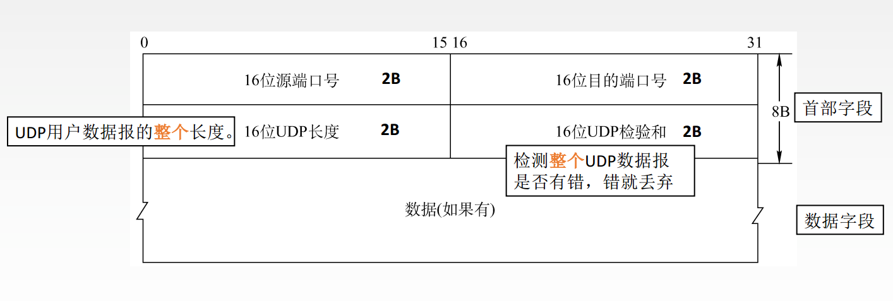

#### 1. 传输层概述

传输层为应用层提供服务，使用网络层的服务，传输层的功能有：

1. 进程与进程之间的通信
2. 复用和分用
3. 对收到的报文进行差错检测
4. UDP和TCP协议

TCP是面向连接的协议，传输数据前先建立连接，数据传输结束后释放连接。特点是可靠，面向连接、延时大适用于大文件。

UDP是无连接的数据用户数据报协议，传送数据前不需要建立连接，收到报文也不要给出任何确认。特点是不可靠、无连接延时小，适用于小文件。

复用指得是应用层所有的引用进程都可以通过传输层再传到网络层。

分用指的是传输层从网络层收到数据后交付指明的应用程序。

#### 2. UDP

UDP在IP数据服务的基础上增加了很少的更能，即复用分用和差错检测功能，主要特点有：

1. 无连接，减少开销和发送数据的延时
2. 使用在最大努力交付，不保证可靠交付
3. 面向报文，适合一次性传输少量数据的网络应用
4. UDP无拥塞控制，适合实时应用
5. UDP首部开销小只有8byte,而TCP是20

UDP首部格式如下：

UDP校验是通过伪首部进行，但是伪首部不会进行传输。校验是对伪首部+首部+数据部分进行2B划分，进行求和求反码，填充到校验和中。接收方则直接求和，全1表示无差错。

#### 3. TCP

TCP是面向连接的传输协议，每一条TCP连接只能有两个端点，TCP提供可靠、无差错、不丢失、不重复、按序到达。TCP提供全双工通信，即发送端和接收端都有发送缓冲和接受缓冲。

TCP首部如下图

1. 序号：在一个TCP连接中传送的字节流中每一个字节都按序编号，序号表示本报文段所发送数据的第一个字节的序号
2. 确认号：期望收到下一个报文段的第一个数据字节的序号，如果确认号为N，则表明已经N-1为止的数据已正确收到
3. 数据偏移：也叫首部长度，TCP报文段的数据起始距离TCP报文段的起始有多远，单位是4B。
4. 紧急位URG：URG=1，表明此报文段中有紧急数据，是高优先级数据，应尽快传送，不用在缓冲里排队，配合紧急指针字段使用。
5. 确认位ACK：ACK=1时确认号有效，在连接建立以后所有的报文段都必须把ACK置为1
6. 推送位PSH：PSH=1时，接收方尽快交付接收应用进程。不在等到缓冲区填满再交付
7. 复位RST：RST=1时，表明TCP连接中出现严重差错，必须释放连接，然后重新建立连接。
8. 同部位SYN：SYN=1时，表示是一个连接请求/连接接受报文
9. 终止位FIN：FIN=1时，表明次报文段发送方数据已发完，要求释放连接
10. 窗口：指的是发送报文段的一方的接受窗口，即现在允许对方发送的数据量。
11. 检验和：检验首部+数据，检验时要加上伪首部。
12. 紧急指针：URG=1时有效，指本报文段紧急数据的字节数
13. 选项：最大报文长度MSS、窗口扩大、时间戳等

TCP连接传输的三个阶段：建立连接、数据传送、释放连接。

三次握手：

1. 客户端方发送请求报文段，无应用层数据，SYN=1，seq=x
2. 服务端为该TCP连接分配缓冲区和变量，并向客户端返回确认报文，SYN=1，ACK=1，ack=x+1
3. 客户端为TCP连接分配缓冲区和变量，并向客户端返回确认的确认，可携带数据。SYN=0，ACK=1，ack=y+1。、

四次挥手：

1. 客户发发送连接释放报文，停止发送数据，关闭TCP连接。FIN=1，seq=u
2. 服务端发送一个确认报文，客户端到服务端方向的连接就释放了,处于半关闭状态，ACK=1，seq=v，ack=u+1
3. 服务端发送完数据，就发出连接释放报文，主动关闭TCP连接，FIN=1，ACK=1，seq=w，ack=u+1，
4. 客户端回送一个确认报文段，等到时间计时器技术后彻底关闭连接，ACK=1，seq=u+1，ack=w+1

TCP可靠性

校验和UDP校验一样，增加伪首部，序号字段指的是报文段的第一个字节的序号。

确认和重传值得是TCP的发送方在规定的时间内没有收到确认就要重传已发送的报文段，超时重传时间采用自适应算法，动态改变重传时间。

冗余确认超过三次触发快速重传。

TCP流量控值让发送方慢点，让接收方来得及接受，TCP利用滑动窗口机制来实现流量控制，在通信过程中，接收方根据自己的接受缓冲大小，动态的调整发送发的窗口大小，即接收窗口rwnd，接收方设置确认报文段的窗口字段来讲rwnd通知给发送方，发送方的爽口取接受窗口和拥塞窗口的最小值。

TCP为每一个连接设有一个持续的计时器，只要TCP连接的一方收到对方的零窗口通知，就启动持续计时器。若持续计时器设置的时间到期，就发送一个零窗口探测报文段，接收方收到探测报文段时给出现在的窗口值。若窗口任然是0，那么发送方就重置持续计时器。

拥塞控制

拥塞控制是防止过多的数据注入到网络中，可以使网络中的路由器或链路不致过载，是一个全局性的过程。
流量控制是点对点通信量的控制，是一个端到端的问题，主要就是抑制发送端发送数据的速率，以便接收端来得及接收。

todo
1.慢开始
2.拥塞控制
3.快重传
4.快恢复

各种wait